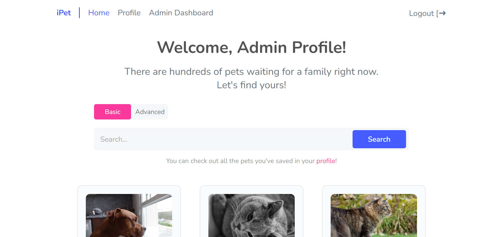
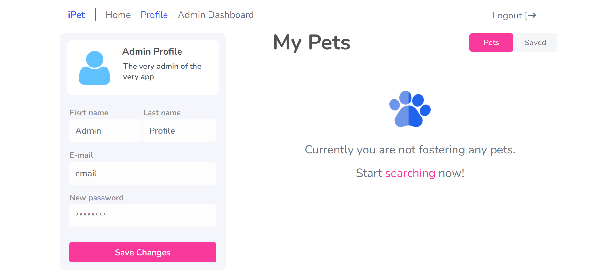

Deployed website: https://ipet-adoption.herokuapp.com

# Pet Adoption Project

A pet-adoption web platform with user and admin side.
Back-end: https://github.com/AnyaJoy/pet-adoption-be

## Table of contents

- [Overview](#overview)
  - [The challenge](#the-challenge)
  - [Screenshots](#screenshots)
  - [Links](#links)
- [My process](#my-process)
  - [Built with](#built-with)
  - [What I learned](#what-i-learned)
- [Author](#author)
- [Acknowledgments](#acknowledgments)

## Overview

### The challenge

On the front-end users should be able to:

- View the Homepage (depending on auth status)
- Sign up and login
- Search pets based on type or advanced search parameters such as status or height of the pet
- View a pet card to see the full information
- Adopt, foster or save the pet for later
- View and change their profile info in the Profile component, toggle between the pets they own or have saved

On the front-end admins should be able to:

- View lists of users and pets on the dashboard
- View each user and their info (name, email, pets they own or foster)
- View each pet profile and be able to change it
- Be able to add a new pet

### Screenshots

### Links

- Live Site URL: https://ipet-adoption.herokuapp.com

## My process

### Built with

- HTML5 markup
- CSS custom properties
- Flexbox
- React

### What I learned
In this project I:
- improvised with the design and UX/UI
- learned how to structure the files and break components into several for better code readability
- worked on a better variables naming and using less comments
- learned how to write api reqests to connect to the server
- deployed server and client side of the app separately

## Author

Github Profile - @AnyaJoy

## Acknowledgments

This project was a part of Full-Stack Development course from ITC. They provided the technical plan! And overall support throughout the project.

